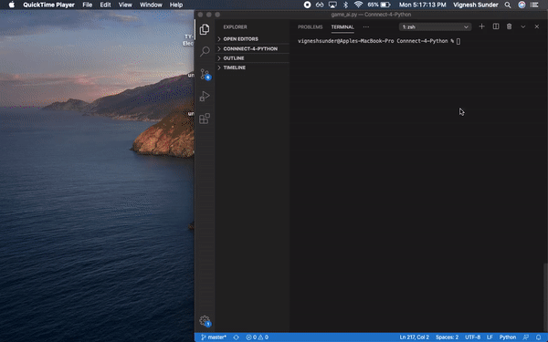
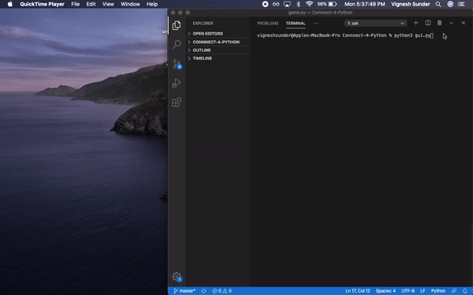

# Connnect 4
Connect Four is a two-player connection board game in which the players first choose a color and then take turns dropping one colored disc from the top into a grid. The pieces fall straight down, occupying the lowest available space within the column. The objective the game is to be the first to form a horizontal, vertical, or diagonal line of four of one's own discs.

<div align="center">

[](https://www.python.org/)

<br>

</div>

------------------------------------------
## Installing and Running

* Install the modules given in requirements.txt file
> numpy==1.18.4
```
pip install numpy
```
> Pillow==7.1.2
```
pip install Pillow
```
> pygame==1.9.6
```
pip install pygame
```
* Run the gui.py file using:
```
python -m gui.py (Python 3.x preferred)
```
------------------------------------------
## Demo

<div align = "center">

Play Against AI



Play Against Human




</div>

------------------------------------------
## Contributors

* [@vig2306](https://github.com/vig2306)
* [@sbangad](https://github.com/sbangad)


